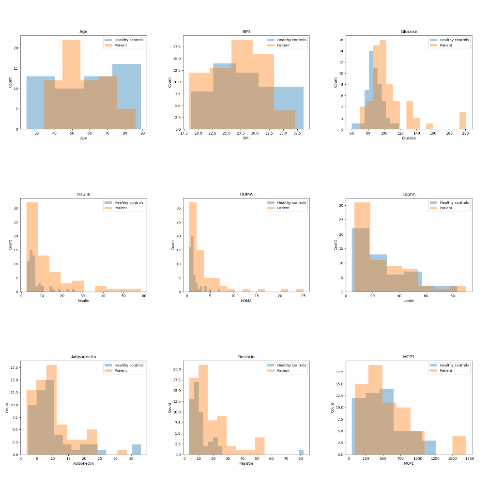
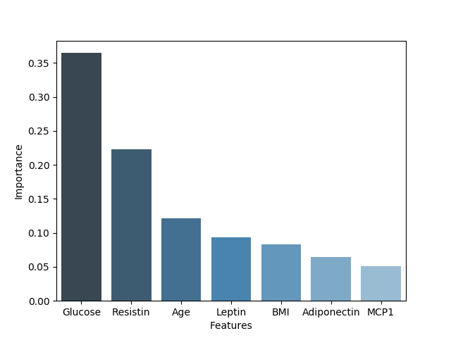

Breast Cancer Prediction Report
================
Akansha Vashisth, Talha Siddiqui
2018/11/24

Introduction
------------

Breast Cancer Predictions analysis aims to identify the strongest predictors of breast cancer. The question that it attempts to answer is as follows:

> What are the strongest predictors of breast cancer?

The analysis is built on the anthropometric data and parameters of 64 patients with breast cancer and 52 healthy controls collected by the Faculty of Medicine of the University of Coimbra and the University Hospital Centre of Coimbra. Identifying the strongest predictors of breast cancer in information that can be gathered in a routine blood analysis is hugely beneficial.

Data Set
--------

The data comprises of nine predictors, and a binary dependent variable indicating the presence or absence of breast cancer. All nine predictors are quantitative variables with positive values. A summary of data set is as follows:

|         |       Age|       BMI|   Glucose|   Insulin|        HOMA|    Leptin|  Adiponectin|   Resistin|       MCP1|
|---------|---------:|---------:|---------:|---------:|-----------:|---------:|------------:|----------:|----------:|
| Min.    |  24.00000|  18.37000|   60.0000|   2.43200|   0.4674087|   4.31100|     1.656020|   3.210000|    45.8430|
| 1st Qu. |  45.00000|  22.97321|   85.7500|   4.35925|   0.9179663|  12.31367|     5.474283|   6.881762|   269.9783|
| Median  |  56.00000|  27.66242|   92.0000|   5.92450|   1.3809387|  20.27100|     8.352692|  10.827740|   471.3225|
| Mean    |  57.30172|  27.58211|   97.7931|  10.01209|   2.6949876|  26.61508|    10.180874|  14.725966|   534.6470|
| 3rd Qu. |  71.00000|  31.24144|  102.0000|  11.18925|   2.8577875|  37.37830|    11.815970|  17.755208|   700.0850|
| Max.    |  89.00000|  38.57876|  201.0000|  58.46000|  25.0503419|  90.28000|    38.040000|  82.100000|  1698.4400|

Table 1. Summary of data set

A visual distribution of each predictor separated by breast cancer patients and healthy controls is as follows:

Figure 1. Distribution of predictors separated by classification

Analysis
--------

The analysis to identify the strongest predictors is best addressed using a decision tree classification algorithm. This algorithm is parametric, which allows it to assess all the features and complete training data to pick the strongest predictors. Other supervised learning approaches that are non-parametric such as K-Nearest Neighbours would not be able to rank the predictors by their importance.

The configuration of the decision tree classifier algorithm was optimized for this analysis by the process of cross-validation. In this process, different values of maximum tree depth and minimum samples split were tested on a subset of the data and the optimum values were used to carry out the predictions. The accuracy of the predictions on training and test data are as follows:

Figure 2. Training and test accuracy

Results
-------

The result of the analysis indicates that Glucose, Resistin and Age are the strongest indicators of breast cancer. The complete list of parameters which are important in predicting breast cancer are as follows:

Figure 3. Predictors of breast cancer

The analysis suggests that Glucose levels are around 36%, Resistin 22% and Age 12% indicative of breast cancer. The predictors that are not indicative of breast cancer are HOMA and Insulin.

Critique
--------

### Limitations

The primary limitation of the analysis is limited data. The model is trained on 80% of the total data which is only 92 examples. That is a very small sample for the model to accurately learn on. The model is then used to test on the remaining 20% of the data. The sizes of training and test data cast a doubt on the accuracy of the model. Additionally, the hyperparameters of the decision tree classifier, other than maximum depth and minimum samples split are not optimized but simply kept default.

Additionally, the simplistic anthropometric data and parameters that can be gathered in a routine blood analysis are certainly useful as biomarkers but are not sufficiently detailed to be key predictors.

### Assumptions

There are several underlying assumptions of the analysis. The first of these assumptions is reliability of the data. The analysis doesn't investigate the source and circumstances under which the data was collected. Additionally, the predictors available in the data are the only source of information available, meaning all else is assumed equal. Lastly, the model of choice for the analysis is assumed to be decision tree classification rather than any other supervised learning algorithm.

Future Direction
----------------

Although the breast cancer predictions analysis accomplishes the fundamental question posed in the beginning, there are several ways in which the analysis could be developed further. The ways in which this analysis can be advanced are as follows:

1.  Calculate likelihood of breast cancer in a new patient
2.  Evaluate feature importance derived by other parametric algorithms
3.  Assess accuracy of predictions using other models
